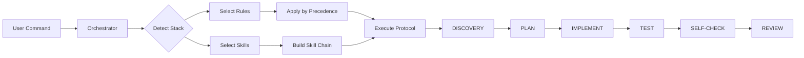

# Architecture Overview

## High-Level Components

```
┌──────────────────────────────────────────────────────────┐
│                    BRP Orchestrator                       │
│  (detects stack, selects rules/skills, enforces protocol) │
├──────────────┬────────────────┬──────────────────────────┤
│  Core Skills │  Stack Skills  │     Canonical Rules      │
│  (8 skills)  │  (10 skills)   │     (.mdc source)        │
├──────────────┴────────────────┴──────────────────────────┤
│              Compile Pipeline (scripts/)                  │
│  parse → bundle → render → sync per IDE target           │
├──────────────────────────────────────────────────────────┤
│  IDE Outputs: Cursor | Claude | Codex | Antigravity |    │
│               Windsurf | Claude Code Plugin              │
└──────────────────────────────────────────────────────────┘
```

## Component Details

### Orchestrator (`skills/orchestrator/brp/`)

The entry point for all `/brp-*` commands. Responsibilities:

1. **Stack detection** — Scan project files for stack signals (see `core/policy.json`)
2. **Rule selection** — Apply precedence: Task > Project > Stack > Global
3. **Skill chain resolution** — Map intent to skill sequence
4. **Protocol enforcement** — Ensure all 6 steps are followed

### Core Skills (`skills/core/`)

Eight workflow skills that implement the BRP protocol:

| Skill           | Protocol Steps Covered       |
| --------------- | ---------------------------- |
| `brp-plan`      | DISCOVERY + PLAN             |
| `brp-implement` | IMPLEMENT                    |
| `brp-test`      | TEST                         |
| `brp-review`    | SELF-CHECK + REVIEW          |
| `brp-fix`       | DISCOVERY + IMPLEMENT + TEST |
| `brp-refactor`  | All 6 steps                  |
| `brp-debug`     | DISCOVERY + PLAN + IMPLEMENT |
| `brp-docs`      | DISCOVERY + IMPLEMENT        |

### Stack Skills (`skills/stacks/`)

Stack-specific conventions and patterns. Selected by the orchestrator based on detected stack:

- `busirocket-core-conventions` — Always active
- `busirocket-react` — React projects
- `busirocket-nextjs` — Next.js projects
- `busirocket-rust` — Rust projects
- `busirocket-typescript-standards` — TypeScript projects
- etc.

### Canonical Rules (`rules/source/`)

IDE-agnostic rules written in `.mdc` format (Markdown with YAML frontmatter). The compile pipeline
reads these and produces IDE-specific outputs.

### Compile Pipeline (`scripts/`)

```
rules/source/*.mdc
       │
       ▼
  parseMdc()        → extract frontmatter + content
       │
       ▼
  generateBundle()  → collect all rules into a bundle
       │
       ▼
  render*()         → transform to each IDE format
       │
       ├─→ syncCursorRules()       → .cursor/rules/
       ├─→ syncClaudeRules()       → .claude/rules/
       ├─→ syncAntigravityRules()  → .agent/rules/
       ├─→ syncWindsurfRules()     → .windsurf/rules/
       ├─→ renderClaude()          → CLAUDE.md
       ├─→ renderAgents()          → AGENTS.md
       ├─→ renderAntigravity()     → GEMINI.md
       └─→ renderWindsurf()        → WINDSURF.md
```

## Data Flow



## Precedence Model

```
┌─────────────────────────┐  Highest priority
│  Task Rules             │  (create/fix/refactor/...)
├─────────────────────────┤
│  Project Rules          │  (.brp/project.json)
├─────────────────────────┤
│  Stack Rules            │  (next/react/rust/php/...)
├─────────────────────────┤
│  Global Rules           │  (personal invariants)
└─────────────────────────┘  Lowest priority
```

When rules conflict, the higher-priority level wins.

## Plugin Distribution

### Claude Code

The `.claude-plugin/plugin.json` manifest registers the project as a Claude Code plugin. Skills in
`skills/` are auto-discovered and namespaced as `/busirocket-agents-tools:<skill-name>`.

### Cursor

Rules are compiled to `.cursor/rules/` which Cursor reads directly. No separate plugin manifest
needed — the rules appear in Cursor's Rules settings.

### Other IDEs

Codex, Antigravity (Gemini), and Windsurf use their respective global link scripts
(`pnpm rules:link:*`) to symlink the generated markdown files.
