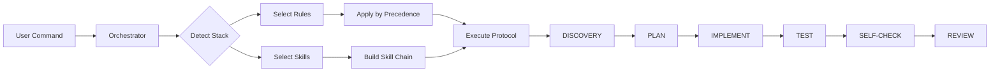

# Architecture Overview

## High-Level Components

```
┌──────────────────────────────────────────────────────────┐
│                    BRP Orchestrator                       │
│  (detects stack, selects skills/rules, enforces protocol) │
├──────────────┬────────────────┬──────────────────────────┤
│  Core Skills │  Stack Skills  │     Canonical Rules      │
│  (9 skills)  │  (future)      │     (.mdc source)        │
├──────────────┴────────────────┴──────────────────────────┤
│              Compile Pipeline (scripts/)                  │
│  compile skills → stage canonical dir → distribute to IDEs │
├──────────────────────────────────────────────────────────┤
│  IDE Outputs: Cursor | Claude | Codex | Antigravity |    │
│               Windsurf | Claude Code Plugin              │
└──────────────────────────────────────────────────────────┘
```

## Component Details

### Orchestrator (`skills/orchestrator/brp/`)

The entry point for all `/brp-*` commands. Responsibilities:

1. **Stack detection** — Scan project files for stack signals (see `core/policy.json`)
2. **Skill chain resolution** — Map intent to skill sequence
3. **Rule selection** — Apply precedence: Task > Project > Stack > Global
4. **Protocol enforcement** — Ensure all 6 steps are followed

### Core Skills (`skills/core/`)

Nine workflow skills that implement the BRP protocol:

| Skill              | Protocol Steps Covered       |
| ------------------ | ---------------------------- |
| `brp-plan`         | DISCOVERY + PLAN             |
| `brp-implement`    | IMPLEMENT                    |
| `brp-test`         | TEST                         |
| `brp-review`       | SELF-CHECK + REVIEW          |
| `brp-fix`          | DISCOVERY + IMPLEMENT + TEST |
| `brp-refactor`     | All 6 steps                  |
| `brp-debug`        | DISCOVERY + PLAN + IMPLEMENT |
| `brp-docs`         | DISCOVERY + IMPLEMENT        |
| `brp-code-quality` | DISCOVERY + PLAN + REVIEW    |

### Skill Classes

- `workflow` — route and execute multi-step work with strong implicit invocation boundaries.
- `domain` — inject narrow stack- or subsystem-specific constraints.
- `execution-assist` — provide deterministic helpers through references, scripts, or tools.

### Stack Skills (`skills/stacks/`)

Stack-specific conventions and patterns. Selected by the orchestrator based on detected stack:

- `busirocket-core-conventions` — Always active
- `busirocket-react` — React projects
- `busirocket-nextjs` — Next.js projects
- `busirocket-rust` — Rust projects
- `busirocket-typescript-standards` — TypeScript projects
- etc.

### Canonical Rules (`src/rules/`)

IDE-agnostic rules written in `.mdc` format (Markdown with YAML frontmatter). The compile pipeline
reads these and produces IDE-specific outputs.

### Compile Pipeline (`scripts/`)

```
src/skills/**/SKILL.md + agents/openai.yaml + manifest
       │
       ▼
  compile-skills    → copy pure skill sources into dist/skills
       │
       ▼
  inject rules index → add generated Rules Index blocks to compiled skills
       │
       ▼
  link-skills       → stage skills in ~/.agents/skills
       │
       ▼
  IDE distribution  → product-managed targets per IDE
```

Rules still compile into `dist/markdown/` and per-IDE rule outputs, but for Codex and other
skill-capable IDEs the main reusable BRP surface is the global skills pipeline, not `AGENTS.md`.

## Data Flow


```mermaid
flowchart LR
    A[User Command] --> B[Orchestrator]
    B --> C{Detect Stack}
    C --> D[Select Rules]
    C --> E[Select Skills]
    D --> F[Apply by Precedence]
    E --> G[Build Skill Chain]
    F --> H[Execute Protocol]
    G --> H
    H --> I[DISCOVERY]
    I --> J[PLAN]
    J --> K[IMPLEMENT]
    K --> L[TEST]
    L --> M[SELF-CHECK]
    M --> N[REVIEW]
```

## Precedence Model

```
┌─────────────────────────┐  Highest priority
│  Task Rules             │  (create/fix/refactor/...)
├─────────────────────────┤
│  Project Rules          │  (.brp/project.json)
├─────────────────────────┤
│  Stack Rules            │  (next/react/rust/php/...)
├─────────────────────────┤
│  Global Rules           │  (personal invariants)
└─────────────────────────┘  Lowest priority
```

When rules conflict, the higher-priority level wins.

## Plugin Distribution

### Claude Code

The `.claude-plugin/plugin.json` manifest registers the project as a Claude Code plugin. Skills in
`skills/` are auto-discovered and namespaced as `/busirocket-agents-tools:<skill-name>`.

### Cursor

Rules are compiled to `.cursor/rules/` which Cursor reads directly. No separate plugin manifest
needed — the rules appear in Cursor's Rules settings.

### Other IDEs

Rule-capable IDEs can still receive generated markdown/rule outputs. Skill-capable IDEs are handled
through the product-managed linker, which stages compiled skills in `~/.agents/skills` first and
then distributes them to IDE-specific targets. Those targets are product conventions unless their
vendor documentation is confirmed separately.
